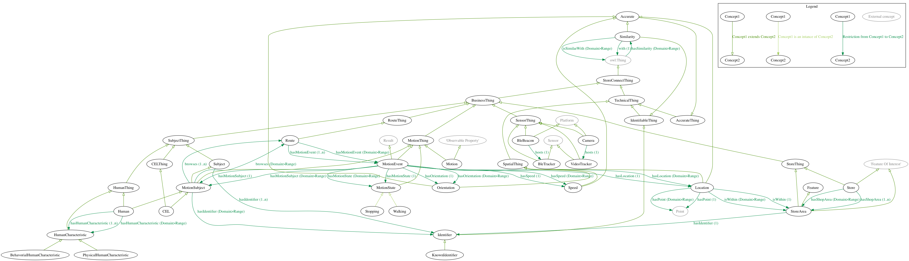

# FUI StoreConnect's main ontology

This ontology is the main ontology used to describe the [FUI StoreConnect project](https://www.pole-scs.org/projet/storeconnect).

In the rest of this document, the main FUI StoreConnect's ontology will be simple named the StoreConnect's ontology.

## Authors

[Aurélien Bourdon](https://github.com/abourdon), Julien Duribreux, [Romain Rouvoy](http://romain.rouvoy.fr), [Lionel Seinturier](http://www.lifl.fr/~seinturi).

## Version

1.0

## Definition

### Imported concepts

The StoreConnect's ontology is based on several standard ontologies. A good understanding of these ontologies is strongly recommended to correctly understand the StoreConnect's one.

- The [OGC & W3C Semantic Sensor Network Ontology](https://www.w3.org/TR/vocab-ssn), by focusing on the [observation perspective](https://www.w3.org/TR/vocab-ssn/#fig-overview-of-the-ssn-classes-and-properties-observation-perspective)
- The [OGC GeoSPARQL Ontology](http://www.opengeospatial.org/standards/geosparql)
- (indirectly) The [OGC & W3C Time Ontology](https://www.w3.org/TR/owl-time/)

### Specific concepts

As described in the previous section, the StoreConnect's ontology is based on the [OGC & W3C Semantic Sensor Network Ontology](https://www.w3.org/TR/vocab-ssn). That's it, any StoreConnect's Sensor is a (or inherits from) [sosa:Sensor](https://www.w3.org/TR/vocab-ssn/#SOSASensor) (or more generally a [sosa:Platform](https://www.w3.org/TR/vocab-ssn/#SOSAPlatform) that hosts [sosa:Sensor](https://www.w3.org/TR/vocab-ssn/#SOSASensor)s) and StoreConnect's Sensor architecture is based on the specific [SSN/SOSA observation perspective](https://www.w3.org/TR/vocab-ssn/#fig-overview-of-the-ssn-classes-and-properties-observation-perspective). Details of this perspective is depicted by the following picture.


Based on this architecture, the StoreConnect's ontology can be represented as follows:



## Manipulation

### Visualization

There are four ways to visualize this ontology:

- By using its [dynamic representation](http://bit.ly/2qHm3z4) (use the [StoreConnect's dynamic visualization server](../../endpoints/dynamic-visualization-server).
- By using its [static representation](http://apiontologie.westeurope.cloudapp.azure.com:8080) (use the [StoreConnect's static visualization server](../../endpoints/static-visualization-server))
- By using the [Protégé](https://protege.stanford.edu/) tool and importing its associated [owl file](./storeconnect-main.owl)
- By using some Protégé's plugins, as the [Protege's OntoGraf plugin](https://protegewiki.stanford.edu/wiki/OntoGraf) and generate the associated image as defined in the [previous section](#specific-concepts)

#### Special note about the Protege's Ontograf plugin DOT generation

As explained above, when using [Protégé](https://protege.stanford.edu/), it is also possible to visualize ontology as a graph, by using the [Protege's OntoGraf plugin](https://protegewiki.stanford.edu/wiki/OntoGraf).
This plugin can also generate a [DOT](https://graphviz.gitlab.io/_pages/doc/info/lang.html) file of the ontology that can be further rendered as an image (see [StoreConnect's ontology picture](#specific-concepts)).
However, this generation is very limited and cannot be configured.

To configure and then _enhance_ this generation, you can use the [enhance-dot-ontograf tool](../../tools/dot-ontograf-enhancer). For instance, the [StoreConnect's ontology picture](#specific-concepts) has been generated by using the following command:

```bash
$ enhance-dot-ontograf.sh 
    -o ./resources/storeconnect.dot
    -e Platform
    -e Sensor 
    -e Result 
    -e "'Feature Of Interest'" 
    -e "'Observable Property'" 
    -e Point 
    -e owl:Thing
    <path/to/the/original/storeconnect.dot> 
```

Where `<path/to/the/original/storeconnect.dot>` is the path to the original [Protege's OntoGraf plugin](https://protegewiki.stanford.edu/wiki/OntoGraf) [DOT](https://graphviz.gitlab.io/_pages/doc/info/lang.html) file.

### Querying

More information about ontology querying can be found in the [endpoints/query-server](../../endpoints/query-server) part.

### Examples of use

This section shows some examples that use the StoreConnect's ontology.

#### Example #1: Describe a simple observation made by a camera sensor inside a store

##### Request definition

The following example describes how to:

- Declare a new camera sensor (more precisely, a camera `sosa:Platform` that hosts a "video tracker" `sosa:Sensor`)
- Register an observation of this camera sensor, that focuses on a motion of an object within a given store

All with a [SPARQL Update query](https://www.w3.org/TR/sparql11-update/):

```sparql
PREFIX rdf:  <http://www.w3.org/1999/02/22-rdf-syntax-ns#>
PREFIX rdfs: <http://www.w3.org/2000/01/rdf-schema#>
PREFIX xsd:  <http://www.w3.org/2001/XMLSchema#>
PREFIX sosa: <http://www.w3.org/ns/sosa/>
PREFIX time: <http://www.w3.org/2006/time#>
PREFIX geo: <http://www.opengis.net/ont/geosparql#>
PREFIX sc: <http://storeconnect/>
BASE <http://example.org/data/>

INSERT DATA {
    <Store/1234> rdf:type sc:Store ;
        rdfs:label "The specific '1234' Store from within a move can be observed"@en .
    
    <Camera/4567> rdf:type sc:Camera ;
        rdfs:label "Camera - 4567"@en ;
        rdfs:comment "Camera - @Id=4567"@en ;
        sosa:hosts <videoTracker/7890> .
    
    <VideoTracker/7890> a sc:VideoTracker ;
        rdfs:label "Video Tracker"@en ;
        sosa:observes sc:Motion .
    
    <Observation/1234> rdf:type sosa:Observation ;
        sosa:observedProperty sc:Motion ;
        sosa:hasFeatureOfInterest  <Store/1234> ;
        sosa:madeBySensor <VideoTracker/7890> ;
        sosa:hasResult [
            rdf:type sc:MotionEvent ;
            sc:hasMotionSubject [
                rdf:type sc:MotionSubject
            ];
            sc:hasMotionState [
                rdf:type sc:Walking
            ];
            sc:hasOrientation [
                rdf:type sc:Orientation ;
                sc:orientation "124.923"^^xsd:float ;
                sc:accuracy "0.87"^^xsd:float
            ];
            sc:hasSpeed [
                rdf:type sc:Orientation ;
                sc:speed "2.78"^^xsd:float ;
                sc:accuracy "0.98"^^xsd:float
            ];
            sc:hasLocation [
                rdf:type sc:Location ;
                sc:floor "1"^^xsd:float ;
                sc:hasPoint [
                    rdf:type geo:Point ;
                    geo:asWKT "POINT(45.99239 76.85746)"^^geo:wktLiteral
                ]
            ]
        ];
        sosa:resultTime [
            rdf:type time:Instant ;
            time:inXSDDateTimeStamp "2017-06-06T12:36:13+00:00"^^xsd:dateTimeStamp 
        ] .
}
```

##### Request sending

This SPARQL Update request can be sent to the [StoreConnect's Ontologies API Query-server Update endpoint](../../endpoints/query-server) as follows (example with the [cURL](https://curl.haxx.se/) command line):

```bash
$ curl <query server endpoint>/strabon/Update --user <credentials> --data 'query: <query>'
```

Where:
- `<query server endpoint>` is the [StoreConnect's Ontologies API query server endpoint](../../endpoints/query-server)
- `<credentials>` is your credentials against the StoreConnect's Ontologies API query server
- `<query>` is the update query

#### Example #2: Retrieve any motion event observations and their associated motion subjects and location coordinates

##### Request definition

Based on the first example, retrieve any motion event observations and their associated motion subjects and location coordinates can be done by executing the following [SPARQL](https://www.w3.org/TR/sparql11-query/) query:

```sparql
PREFIX sosa: <http://www.w3.org/ns/sosa/>
PREFIX geo: <http://www.opengis.net/ont/geosparql#>
PREFIX sc: <http://storeconnect/>

SELECT DISTINCT ?observation ?subject ?coordinates
WHERE {
    # Give all sc:MotionEvent observations
    ?observation a sosa:Observation .
    ?observation sosa:hasResult ?result .
    ?result a sc:MotionEvent .
    
    # And retrieve from them their motion subject and associated location coordinates
    ?result sc:hasMotionSubject ?subject .
    ?result sc:hasLocation ?location .
    ?location sc:hasPoint ?point .
    ?point geo:asWKT ?coordinates .
}
```

##### Request sending

This SPARQL Query request can be sent to the [StoreConnect's Ontologies API Query-server Query endpoint](../../endpoints/query-server) as follows (example with the [cURL](https://curl.haxx.se/) command line):

```bash
$ curl <query server endpoint>/strabon/Query --header 'Accept: application/sparql-results+xml' --data 'query: <query>'
```
Where:
- `<query server endpoint>` is the [StoreConnect's Ontologies API query server endpoint](../../endpoints/query-server)
- `<query>` is the query
- The expected result format is `SPARQL/XML`

What would give the following result (in `SPARQL/XML` format):

```xml
<?xml version='1.0' encoding='UTF-8'?>
<sparql xmlns='http://www.w3.org/2005/sparql-results#'>
    <head>
        <variable name='observation'/>
        <variable name='subject'/>
        <variable name='coordinates'/>
    </head>
    <results>
        <result>
            <binding name='observation'>
                <uri>http://example.org/data/Observation/1234</uri>
            </binding>
            <binding name='subject'>
                <bnode>node1cbrrlfrpx25</bnode>
            </binding>
            <binding name='coordinates'>
                <literal datatype='http://www.opengis.net/ont/geosparql#wktLiteral'>POINT(45.99239 76.85746)</literal>
            </binding>
        </result>
    </results>
</sparql>
```

#### Example #3: Create similarity between two objects

##### Request definition

To express that two objects are similar, you can use the `sc:Similarity` concept.

For instance, the following [SPARQL Update query](https://www.w3.org/TR/sparql11-update/) defines that two motion subjects (`sc:MotionSubject`) are similar:

```sparql
PREFIX rdf:  <http://www.w3.org/1999/02/22-rdf-syntax-ns#>
PREFIX xsd:  <http://www.w3.org/2001/XMLSchema#>
PREFIX sc: <http://storeconnect/>
BASE <http://example.org/data/>
 
INSERT DATA {
    # Lets define our two sc:MotionSubject
    <MotionSubject/1234> rdf:type sc:MotionSubject .
    <MotionSubject/5678> rdf:type sc:MotionSubject .
    
    # Now make them similar at 85 percent
    <MotionSubject/1234> sc:hasSimilarity [
        rdf:type sc:Similarity ;
        sc:isSimilarWith <MotionSubject/5678> ;
        sc:accuracy "85.0"^^xsd:float
    ] .
}
 ```

##### Request sending

This SPARQL Update request can be sent to the [StoreConnect's Ontologies API Query-server Update endpoint](../../endpoints/query-server) as follows (example with the [cURL](https://curl.haxx.se/) command line):

```bash
$ curl <query server endpoint>/strabon/Update --user <credentials> --data 'query: <query>'
```

Where:
- `<query server endpoint>` is the [StoreConnect's Ontologies API query server endpoint](../../endpoints/query-server)
- `<credentials>` is your credentials against the StoreConnect's Ontologies API query server
- `<query>` is the update query
 
#### Example #4: Retrieve any similar objects to a given one

##### Request definition

Now, based on the previous example, lets say we want to have all similar motion subjects to our `<MotionSubject/1234>` one. This can be expressed with the following [SPARQL](https://www.w3.org/TR/sparql11-query/) query:

```sparql
PREFIX xsd: <http://www.w3.org/2001/XMLSchema#>
PREFIX sc: <http://storeconnect/>
BASE <http://example.org/data/>

SELECT DISTINCT ?similarSubject ?similarityWeight
WHERE {
    <MotionSubject/1234> sc:hasSimilarity ?similarity .
    ?similarity sc:isSimilarWith ?similarSubject .
    ?similarity sc:accuracy ?similarityWeight .
    FILTER (?similarityWeight > "75"^^xsd:float) . 
}
```

##### Request sending

This SPARQL Query request can be sent to the [StoreConnect's Ontologies API Query-server Query endpoint](../../endpoints/query-server) as follows (example with the [cURL](https://curl.haxx.se/) command line):

```bash
$ curl <query server endpoint>/strabon/Query --header 'Accept: application/sparql-results+xml' --data 'query: <query>'
```

Where:
- `<query server endpoint>` is the [StoreConnect's Ontologies API query server endpoint](../../endpoints/query-server)
- `<query>` is the query
- The expected result format is `SPARQL/XML`

What would give the following result (in `SPARQL/XML` format):

```xml
<?xml version='1.0' encoding='UTF-8'?>
<sparql xmlns='http://www.w3.org/2005/sparql-results#'>
    <head>
        <variable name='similarSubject'/>
        <variable name='similarityWeight'/>
    </head>
    <results>
        <result>
            <binding name='similarSubject'>
                <uri>http://example.org/data/MotionSubject/5678</uri>
            </binding>
            <binding name='similarityWeight'>
                <literal datatype='http://www.w3.org/2001/XMLSchema#float'>85.0</literal>
            </binding>
        </result>
    </results>
</sparql>
```